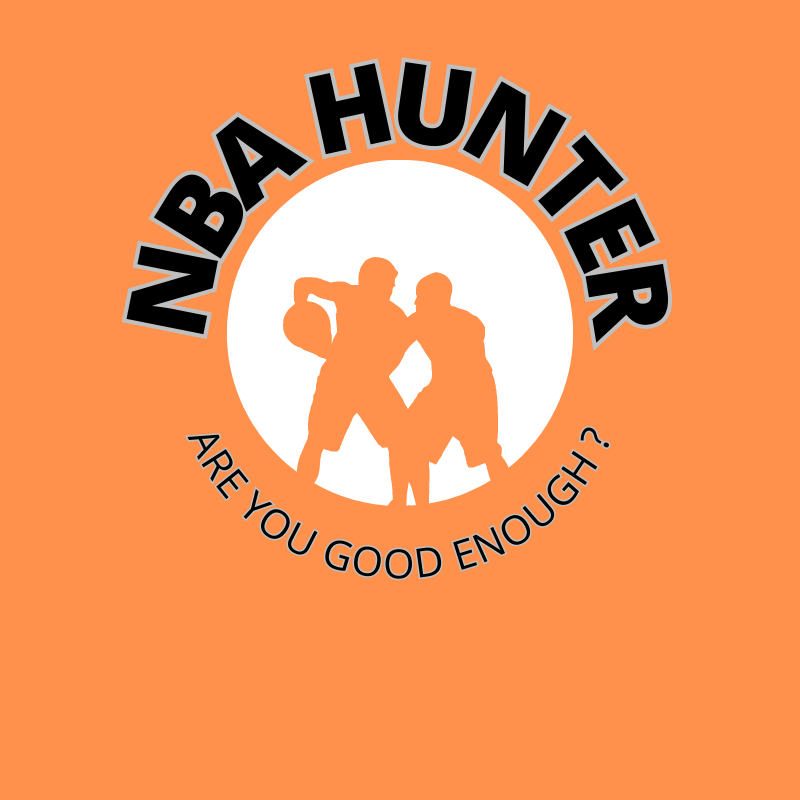
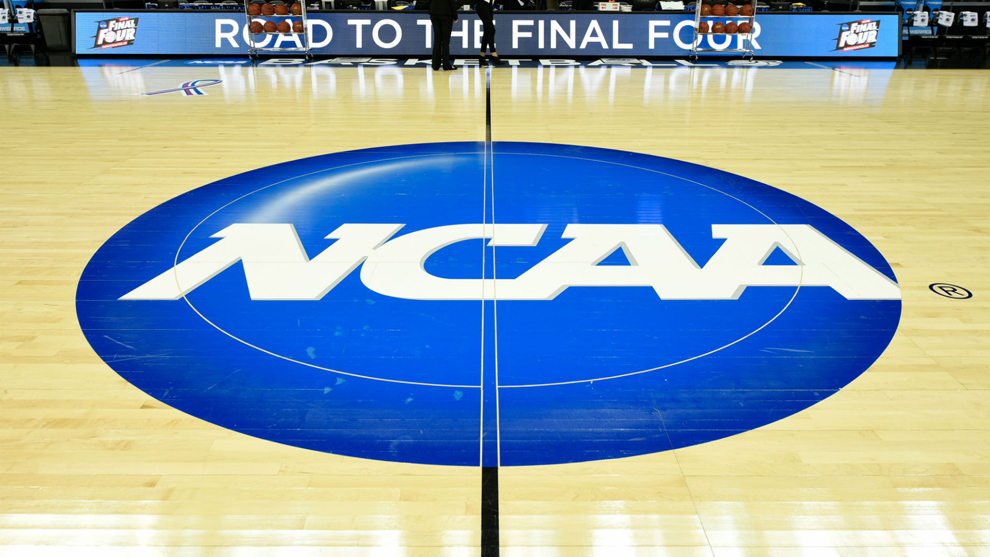

¡Bienvenido a mi proyecto de compilación de datos de jugadores universitarios y de la NBA desde 2002 hasta 2023!

Este proyecto tiene como objetivo recopilar datos de jugadores universitarios y de la NBA en un período de 21 años, desde 2002 hasta 2023. Los datos recopilados incluyen información sobre los jugadores universitarios que pasan a jugar en la NBA y los que no.
Como segundo objetivo he realizado una modelo predictivo en base a estos datos el cual nos puede ayudar a predecir si un jugador llegará o no a la nba en base a sus estadísticas universitarias.
A su vez,sacaremos patrones como por ejemplo el porcentaje de jugadores universitarios que optan a ir a la NBA, el equipo que más jugadores ha brindado a la misma y muchos otros datos interesantes.

La NCAA tiene un total de 357 equipos universitarios entre todas sus conferencias.

Si que es verdad que existe un factor importante el cual supone que muchos jugadores no vayan al draft, pero sin embargo sean contratados luego como agentes libres.Todo esto depende en gran parte de las necesidades de los equipos y la calidad de los jugadores del draft,de cualquier manera, el promedio de jugadores por temporada escogidos para la NBA de la NCAA está alrededor de los 60 jugadores por temporada.El periodo máximo para jugar en la NCAA está establecido en 4 años, por lo que si un jugador no  es escogido en el draft pero sus años universitarios acabaron,cabe la posibilidad de que lo contraten como agente libre dependiendo de necesidades del equipo que realiza el fichaje.

La extracción de datos en este caso ha sido realizada desde la página web (https://basketball.realgm.com/)

El proceso de extracción de datos a consistido en automatizar la página anteriormente citada, de modo que Selenium recorría cada temporada e iba extrayendo tabla por tabla.

La limpieza de datos de la misma la he realizado con librerías como numpy y pandas.Posteriormente para realizar mi modelo de predicción he utilizado la librería de sckitlearn , donde he probabo diferentes modelos de predicción como el random forest,decision tree o KNN entre otros. 

El output final lo tenéis disponible, el cual es un streamlit que se dividirá en los siguientes apartados : 
·Introducción a la NCAA y la NBA
·Visualización de datos relevantes en referencia a dos ligas
·Presentación de modelo predictor donde habrá unos inputs de estadísticas para adjuntar y así poder predecir si el susodicho entraría o no en la NBA,basándonos en las estadísticas de los últimos 21 años. 

Herramientas utilizadas para llevar a cabo este proyecto han sido: 
# Bibliotecas Utilizadas

A continuación se enumeran las bibliotecas utilizadas en este proyecto:

- [seaborn](https://seaborn.pydata.org/): Biblioteca para visualización estadística basada en matplotlib.
- [matplotlib](https://matplotlib.org/stable/index.html): Biblioteca para visualización de gráficos en Python.
- [pandas](https://pandas.pydata.org/): Biblioteca para manipulación y análisis de datos en Python.
- [numpy](https://numpy.org/): Biblioteca para cálculos numéricos en Python.
- [streamlit](https://streamlit.io/): Biblioteca para crear aplicaciones web interactivas en Python.
- [selenium](https://www.selenium.dev/): Biblioteca para automatización de pruebas en aplicaciones web.
- [scikit-learn](https://scikit-learn.org/stable/): Biblioteca para aprendizaje automático en Python.
